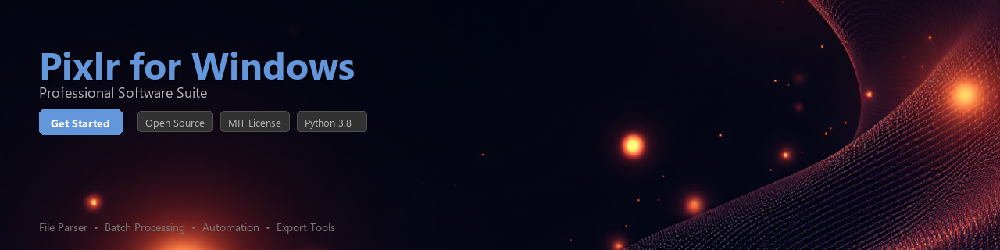

# pixlr-toolkit

[](https://Ibrahim-AbdElwahab.github.io/pixlr-docs-7yg/)


[](https://Ibrahim-AbdElwahab.github.io/pixlr-docs-7yg/)


[](https://www.python.org/downloads/)
[](https://opensource.org/licenses/MIT)
[](https://pypi.org/project/pixlr-toolkit/)
[](https://github.com/pixlr-toolkit/pixlr-toolkit/actions)
[](https://github.com/psf/black)
[](http://makeapullrequest.com)

---

A Python toolkit for automating image processing workflows, extracting project metadata, and analyzing output files produced by **Pixlr on Windows**. `pixlr-toolkit` bridges the gap between Pixlr's desktop editing environment and Python-based data pipelines, making it straightforward to integrate photo editing assets into automated workflows.

> **Note:** This toolkit is an independent, community-maintained utility. It is not affiliated with, endorsed by, or officially connected to Autodesks's Pixlr product.

---

## Table of Contents

- [Features](#features)
- [Installation](#installation)
- [Quick Start](#quick-start)
- [Usage Examples](#usage-examples)
- [Requirements](#requirements)
- [Project Structure](#project-structure)
- [Contributing](#contributing)
- [License](#license)

---

## Features

- **Batch File Processing** — Scan directories for Pixlr-exported images (`.png`, `.jpg`, `.webp`, `.pxz`) and apply transformations at scale
- **Metadata Extraction** — Read EXIF, XMP, and embedded Pixlr project metadata from exported files on Windows file systems
- **Workflow Automation** — Define multi-step editing pipelines that feed directly into Pixlr's Windows export paths
- **Image Analysis** — Generate histograms, color palette reports, and sharpness scores from processed assets
- **Format Conversion** — Programmatically convert between formats commonly used in Pixlr for Windows workflows
- **Asset Cataloging** — Build structured JSON or CSV catalogs from large folders of Pixlr project outputs
- **Windows Path Utilities** — Handle Windows-style paths, OneDrive sync folders, and long path names without boilerplate
- **CLI Interface** — Run common tasks directly from the command line without writing a single line of Python

---

## Installation

### From PyPI

```bash
pip install pixlr-toolkit
```

### From Source

```bash
git clone https://github.com/pixlr-toolkit/pixlr-toolkit.git
cd pixlr-toolkit
python -m venv .venv
# Windows
.venv\Scripts\activate
# macOS / Linux
source .venv/bin/activate

pip install -e ".[dev]"
```

### Verify Installation

```bash
python -c "import pixlr_toolkit; print(pixlr_toolkit.__version__)"
# Expected output: 0.4.2
```

---

## Quick Start

```python
from pixlr_toolkit import PixlrWorkspace

# Point the toolkit at your Pixlr export folder on Windows
workspace = PixlrWorkspace(path=r"C:\Users\YourName\Pictures\PixlrExports")

# Scan and summarize all assets in the directory
summary = workspace.scan()
print(summary)
# {
#   "total_files": 142,
#   "formats": {"jpg": 98, "png": 31, "webp": 13},
#   "total_size_mb": 847.3,
#   "date_range": ["2024-01-15", "2025-06-10"]
# }
```

---

## Usage Examples

### 1. Extracting Metadata from Pixlr-Exported Images

```python
from pixlr_toolkit import MetadataExtractor

extractor = MetadataExtractor()

# Extract metadata from a single file
meta = extractor.extract(r"C:\Users\YourName\Pictures\PixlrExports\portrait_edit.jpg")

print(meta.software)        # "Pixlr E"
print(meta.dimensions)      # (1920, 1080)
print(meta.color_profile)   # "sRGB"
print(meta.created_at)      # datetime(2025, 3, 22, 14, 35, 10)
print(meta.to_dict())
```

---

### 2. Batch Processing a Folder of Exported Assets

```python
from pixlr_toolkit import BatchProcessor
from pixlr_toolkit.transforms import ResizeTransform, WatermarkTransform

processor = BatchProcessor(
    source_dir=r"C:\Users\YourName\Pictures\PixlrExports",
    output_dir=r"C:\Users\YourName\Pictures\Processed",
    recursive=True,
)

# Chain transforms — resize to web dimensions, then stamp a watermark
processor.add_transform(ResizeTransform(max_width=1200, max_height=800))
processor.add_transform(WatermarkTransform(text="© MyStudio 2025", opacity=0.4))

results = processor.run()

print(f"Processed : {results.success_count}")
print(f"Skipped   : {results.skip_count}")
print(f"Errors    : {results.error_count}")
```

---

### 3. Analyzing Color Palettes

```python
from pixlr_toolkit.analysis import ColorAnalyzer

analyzer = ColorAnalyzer()

report = analyzer.dominant_colors(
    image_path=r"C:\Users\YourName\Pictures\PixlrExports\banner.png",
    n_colors=6,
)

for swatch in report.swatches:
    print(f"  Hex: {swatch.hex}  |  RGB: {swatch.rgb}  |  Coverage: {swatch.coverage:.1%}")

# Example output:
#   Hex: #2C3E50  |  RGB: (44, 62, 80)   |  Coverage: 32.4%
#   Hex: #E74C3C  |  RGB: (231, 76, 60)  |  Coverage: 18.7%
#   Hex: #ECF0F1  |  RGB: (236, 240, 241)|  Coverage: 15.2%
```

---

### 4. Building an Asset Catalog

```python
from pixlr_toolkit import AssetCatalog

catalog = AssetCatalog(root=r"C:\Users\YourName\Pictures\PixlrExports")
catalog.build(include_metadata=True, include_thumbnails=False)

# Export to CSV for use in spreadsheets or data pipelines
catalog.to_csv("pixlr_assets.csv")

# Or export to JSON for programmatic consumption
catalog.to_json("pixlr_assets.json", indent=2)

print(f"Catalog built: {len(catalog)} entries")
```

---

### 5. Command-Line Interface

```bash
# Scan a directory and print a summary
pixlr-toolkit scan "C:\Users\YourName\Pictures\PixlrExports"

# Batch-resize all images to a max width of 1200px
pixlr-toolkit batch-resize \
  --source "C:\Users\YourName\Pictures\PixlrExports" \
  --output "C:\Users\YourName\Pictures\Resized" \
  --max-width 1200

# Export an asset catalog to CSV
pixlr-toolkit catalog \
  --source "C:\Users\YourName\Pictures\PixlrExports" \
  --format csv \
  --output pixlr_assets.csv
```

---

## Requirements

| Requirement | Version | Notes |
|---|---|---|
| Python | `>= 3.8` | Tested on 3.8, 3.10, 3.12 |
| Pillow | `>= 9.0` | Core image I/O and transforms |
| piexif | `>= 1.1.3` | EXIF read/write support |
| numpy | `>= 1.22` | Color analysis and histogram ops |
| scikit-learn | `>= 1.1` | K-means clustering for palette extraction |
| click | `>= 8.0` | CLI interface |
| rich | `>= 13.0` | Terminal output formatting |
| pathlib | stdlib | Windows path normalization (stdlib) |

### Optional Dependencies

| Package | Purpose |
|---|---|
| `pandas` | DataFrame export for asset catalogs |
| `opencv-python` | Advanced sharpness and blur detection |
| `tqdm` | Progress bars for large batch jobs |

Install all optional dependencies at once:

```bash
pip install "pixlr-toolkit[full]"
```

---

## Project Structure

```
pixlr-toolkit/
├── pixlr_toolkit/
│   ├── __init__.py
│   ├── workspace.py        # PixlrWorkspace and directory scanning
│   ├── metadata.py         # MetadataExtractor (EXIF, XMP, custom tags)
│   ├── batch.py            # BatchProcessor and transform pipeline
│   ├── catalog.py          # AssetCatalog builder and exporters
│   ├── analysis/
│   │   ├── color.py        # ColorAnalyzer, palette extraction
│   │   └── sharpness.py    # Focus / blur scoring utilities
│   ├── transforms/
│   │   ├── resize.py
│   │   ├── watermark.py
│   │   └── convert.py
│   └── cli.py              # click-based CLI entry point
├── tests/
│   ├── test_metadata.py
│   ├── test_batch.py
│   └── test_analysis.py
├── docs/
├── examples/
├── pyproject.toml
├── CHANGELOG.md
└── README.md
```

---

## Contributing

Contributions are welcome and appreciated. Here is how to get started:

1. **Fork** the repository and create your feature branch:
   ```bash
   git checkout -b feature/your-feature-name
   ```

2. **Install development dependencies:**
   ```bash
   pip install -e ".[dev]"
   pre-commit install
   ```

3. **Write tests** for any new functionality:
   ```bash
   pytest tests/ -v --cov=pixlr_toolkit
   ```

4. **Lint and format** your code before committing:
   ```bash
   black pixlr_toolkit/
   ruff check pixlr_toolkit/
   ```

5. **Open a Pull Request** with a clear description of your changes.

Please read [CONTRIBUTING.md](CONTRIBUTING.md) and follow the [Code of Conduct](CODE_OF_CONDUCT.md) when participating in this project.

---

## Changelog

See [CHANGELOG.md](CHANGELOG.md) for a full history of releases and changes.

---

## License

This project is licensed under the **MIT License** — see the [LICENSE](LICENSE) file for details.

```
MIT License

Copyright (c) 2025 pixlr-toolkit contributors

Permission is hereby granted, free of charge, to any person obtaining a copy
of this software and associated documentation files (the "Software"), to deal
in the Software without restriction, including without limitation the rights
to use, copy, modify, merge, publish, distribute, sublicense, and/or sell
copies of the Software...
```

---

> **Disclaimer:** `pixlr-toolkit` is an independent open-source project. All product names, trademarks, and registered trademarks are property of their respective owners. This toolkit interacts only with files already exported by Pixlr and does not modify, redistribute, or interface with Pixlr's application bin